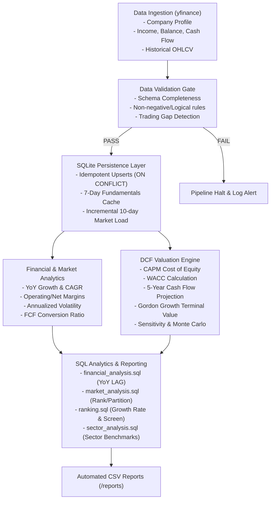

# End-to-End Project Study Guide & Interview Cheatsheet
## Automated Financial Data Pipeline & Capital Markets Valuation Engine

---

## 1. Executive Summary & The "Elevator Pitch"

### The 30-Second Pitch
> *"I built an automated end-to-end financial data pipeline and equity valuation engine in Python and SQLite. It ingests fundamental financial statements and historical market data for public equities, validates data quality using deterministic rules, and stores it in an idempotent relational schema. On top of that storage layer, it runs a Discounted Cash Flow (DCF) valuation model using CAPM and WACC, and executes analytical SQL window functions to rank stocks by revenue growth and screen for undervalued securities. The entire pipeline is deployed on AWS EC2 scheduled via Linux cron."*

### Target Roles & Positioning
*   **Target Domains:** Data Engineering, Financial Data Analytics, Quantitative Analytics.
*   **Industry Focus:** FinTech, Capital Markets, Asset Management, Investment Banking Analytics.
*   **Key Philosophy:** This project showcases **data engineering and analytical rigor** (idempotency, schema design, validation gates, complex SQL window functions, financial modeling). It deliberately avoids unnecessary software framework overhead (no React, no Docker, no microservices, no bloated distributed systems) to focus on pure data reliability and domain intelligence.

---

## 2. High-Level System Architecture

The pipeline follows a classic modular **ETL + Analytics + Modeling** flow:



---

## 3. Detailed Component Breakdown

### Component 1: Data Ingestion (`src/data_fetcher.py`)
*   **Data Source:** `yfinance` (Yahoo Finance API).
*   **Extracted Data:**
    1.  **Company Profile:** Sector, Industry, Equity Beta, Shares Outstanding.
    2.  **Financial Statements:** Annual Income Statements, Balance Sheets, Cash Flow Statements (minimum 3 years).
    3.  **Market Data:** Historical OHLCV (Open, High, Low, Close, Volume) prices.
*   **Real-World Engineering Challenges Solved:**
    *   *Messy / Inconsistent Aliases:* Yahoo Finance frequently changes line-item naming conventions (e.g., `Total Revenue` vs `Operating Revenue` vs `Revenue`). We built `PREFERRED_LINE_ITEMS`, a prioritized mapping dictionary that checks aliases in order of preference and takes only the first match, preventing duplicate records.
    *   *Ghost / Incomplete Columns:* `yfinance` often returns trailing columns containing only a single item (like `Interest Expense`). We instituted `ANCHOR_LINE_ITEMS` (`total_revenue` for income, `total_assets` for balance, `operating_cash_flow` for cash flow). If a period lacks its anchor item, the entire column is discarded.

### Component 2: Data Validation & QA Gate (`src/data_validator.py`)
*   **Purpose:** Enforces data quality *before* touching the database. If validation fails, the pipeline aborts immediately.
*   **Validation Rules:**
    *   *Completeness:* Verifies all required line items (Revenue, EBIT, Net Income, Assets, Debt, Cash, OCF, CapEx) and OHLCV fields exist.
    *   *Logical Integrity:*
        *   Revenue > 0, Total Assets > 0.
        *   Prices > 0, Volume $\ge$ 0.
        *   $High \ge Low$, $High \ge Open$, $High \ge Close$, $Low \le Open$, $Low \le Close$.
    *   *History Depth:* Ensures $\ge 3$ years of financial statements.
    *   *Market Continuity:* Emits a warning if consecutive trading gaps exceed 5 days (detecting anomalies beyond normal weekends/holidays).
*   **Output:** Generates a structured `ValidationReport` printed to logs and console.

### Component 3: SQLite Persistence Layer (`src/database.py`)
*   **Schema (4 Relational Tables):**
    1.  `companies`: Metadata (`ticker`, `company_name`, `sector`, `industry`). Unique on `ticker`.
    2.  `financial_statements`: Long/narrow format (`company_id`, `statement_type`, `period`, `line_item`, `value`, `fetched_at`). Unique on `(company_id, statement_type, period, line_item)`.
    3.  `market_data`: Time-series OHLCV (`company_id`, `date`, `open`, `high`, `low`, `close`, `volume`, `fetched_at`). Unique on `(company_id, date)`.
    4.  `valuation_results`: Model outputs (`company_id`, `valuation_date`, `wacc`, `terminal_growth`, `enterprise_value`, `equity_value`, `intrinsic_value`, `current_price`).
*   **Key Architectural Design Decisions:**
    *   *WAL Mode (Write-Ahead Logging):* Enables concurrent reads while writing occurs.
    *   *Idempotent Upserts (`INSERT ... ON CONFLICT DO UPDATE`):* Any run can be repeated without duplicating rows or violating unique constraints.
    *   *Dataset-Specific Freshness Optimization:*
        *   Financial statements change only quarterly/annually $\rightarrow$ cached for **7 days**. If fresh, raw statement extraction is skipped.
        *   Market data checks the most recent date stored in the DB: if missing $\rightarrow$ fetches 2 years; if present $\rightarrow$ fetches only trailing 10 days for fast incremental upsert.
        *   Company profile (beta and share count) is always refreshed.

### Component 4: Financial & Market Analytics (`src/financial_analysis.py`, `src/market_analysis.py`)
*   **Fundamental Metrics:**
    *   Year-over-Year (YoY) Revenue Growth & Multi-Year CAGR.
    *   Operating Margin ($\frac{\text{Operating Income}}{\text{Revenue}}$) & Net Margin ($\frac{\text{Net Income}}{\text{Revenue}}$).
    *   Free Cash Flow: $FCF = \text{Operating Cash Flow} - |\text{Capital Expenditure}|$ (strictly handles negative sign conventions for CapEx).
    *   **FCF Conversion Ratio:** $\frac{FCF}{\text{Net Income}}$. A critical metric used to calibrate cash flow projections against reported earnings.
    *   Balance Sheet Ratios: Debt-to-Equity, Return on Assets (ROA), Cash-to-Debt.
*   **Market Metrics:**
    *   Daily percentage returns.
    *   Month-end resampling and month-over-month returns.
    *   **Annualized Volatility:** Standard deviation of daily returns annualized over full history ($\sigma_{\text{daily}} \times \sqrt{252}$).

### Component 5: DCF Valuation Engine (`src/valuation.py`)
*   **Cost of Capital Formulation:**
    *   **CAPM Cost of Equity ($K_e$):**
        $$K_e = R_f + \beta \times ERP$$
        (Risk-Free Rate $R_f = 4.2\%$, Equity Risk Premium $ERP = 5.5\%$, $\beta$ from yfinance).
    *   **After-Tax Cost of Debt ($K_d$):**
        $$K_d = \frac{\text{Interest Expense}}{\text{Total Debt}} \times (1 - \text{Tax Rate})$$
        (With sanity bounds between 1% and 20%; defaults to 4.5% pre-tax if data missing).
    *   **WACC (Weighted Average Cost of Capital):**
        $$WACC = \left(\frac{E}{E + D} \times K_e\right) + \left(\frac{D}{E + D} \times K_d\right)$$
*   **DCF Valuation Mechanics:**
    1.  Projects Revenue for 5 years using baseline CAGR.
    2.  Projects $EBIT = \text{Revenue}_t \times \text{Operating Margin}$.
    3.  Projects $NOPAT = EBIT \times (1 - \text{Tax Rate})$.
    4.  Derives projected $FCF = NOPAT \times \text{avg\_fcf\_conversion\_ratio}$ (directly leveraging historical cash conversion performance).
    5.  Discounts FCFs to Present Value at WACC.
    6.  Computes **Terminal Value** using Gordon Growth Model:
        $$TV_5 = \frac{FCF_5 \times (1 + g)}{WACC - g}$$
        (With an automatic defensive safety clamp ensuring $WACC > g + 1.0\%$).
    7.  **Enterprise to Equity Bridge:**
        $$\text{Enterprise Value} = \sum PV(FCF) + PV(TV)$$
        $$\text{Equity Value} = \text{Enterprise Value} + \text{Cash} - \text{Total Debt}$$
        $$\text{Intrinsic Value Per Share} = \frac{\text{Equity Value}}{\text{Shares Outstanding}}$$
*   **Valuation Extensions:**
    *   *Scenario Analysis:* Bull (+20% growth, +10% margin, -50 bps WACC), Base, Bear (-20% growth, -10% margin, +100 bps WACC).
    *   *Sensitivity Matrix:* $5 \times 5$ matrix varying WACC and Terminal Growth rate ($g$).
    *   *Monte Carlo Simulation:* 10,000 NumPy iterations sampling normal distributions of growth, margins, WACC, and terminal growth with fixed random seeds for deterministic reproducibility.

### Component 6: SQL Analytics & Reporting (`sql/*.sql`, `src/analytics.py`)
This is the showcase for advanced analytical SQL:
1.  **`financial_analysis.sql`:** Uses Common Table Expressions (CTEs) and `LAG() OVER (PARTITION BY ticker ORDER BY period ASC)` to compute YoY revenue growth and margin trends across multi-year statements.
2.  **`market_analysis.sql`:** Aggregates daily prices into month-end dates using `ROW_NUMBER()`, calculates monthly returns with `LAG()`, and ranks companies using `RANK() OVER (PARTITION BY month ORDER BY return DESC)` both globally and partitioned by sector.
3.  **`ranking.sql`:** Ranks companies on **Revenue Growth Rate (%)** (not raw revenue level, ensuring analytical fairness across company sizes), operating margins, and Free Cash Flow. Applies a 3-factor fundamental + market screen:
    $$\text{YoY Revenue Growth} > 0\% \quad\text{AND}\quad \text{Operating Margin} > 0\% \quad\text{AND}\quad \text{Trailing Month Return} > 0\%$$
4.  **`sector_analysis.sql`:** Compares intrinsic value to current market price, determines Undervalued/Overvalued signals, and computes relative upside against sector averages.

### Component 7: Pipeline Orchestrator & CLI (`src/pipeline.py`, `src/main.py`)
*   Single CLI command: `python src/main.py --ticker AAPL [--refresh]`.
*   Includes path resolution safeguards (`sys.path` injection) allowing direct execution from any working directory.
*   Outputs human-readable summaries and exports four CSV reports into `reports/`.

---

## 4. Key Financial Concepts Explained for Interviews

| Financial Term | What It Means in Plain English | Formula / Calculation in Project |
| :--- | :--- | :--- |
| **DCF (Discounted Cash Flow)** | Valuing a business today based on all future cash it will generate, discounted back to present value. | $\sum \frac{FCF_t}{(1+WACC)^t} + \frac{TerminalValue}{(1+WACC)^N}$ |
| **WACC** | The blended cost of capital the company pays to satisfy both debt holders and equity shareholders. | $\frac{E}{V}K_e + \frac{D}{V}K_d(1-t)$ |
| **CAPM ($K_e$)** | Expected return required by equity investors given the stock's market risk ($\beta$). | $R_f + \beta \times ERP$ |
| **Beta ($\beta$)** | Volatility of the stock relative to the broader market ($\beta > 1$ is more volatile). | Extracted directly from yfinance metadata. |
| **Gordon Growth Model** | Estimates value of all cash flows beyond Year 5 assuming constant perpetual growth. | $\frac{FCF \times (1 + g)}{WACC - g}$ |
| **FCF Conversion Ratio** | How efficiently accounting net income converts into real cash flow. | $\frac{\text{Free Cash Flow}}{\text{Net Income}}$ |
| **Enterprise vs. Equity Value** | Enterprise Value is the value of the entire core operations. Equity value is what belongs to shareholders. | $\text{Equity Value} = \text{Enterprise Value} + \text{Cash} - \text{Debt}$ |

---

## 5. Potential Interview Questions & Answers ("The Defense")

### Data Engineering Questions

#### Q1: "Why did you choose SQLite over PostgreSQL or Snowflake?"
> **Answer:** *"For this project's workload (tracking target equity universes with periodic batch execution), SQLite provides zero-latency in-process querying, zero external daemon maintenance, and zero infrastructure cost. Furthermore, SQLite 3.35+ supports full window functions (`LAG`, `ROW_NUMBER`, `RANK`), CTEs, and `ON CONFLICT DO UPDATE` upserts, giving us enterprise relational SQL semantics without running a separate database server. In production with a larger universe, the schema easily migrates to PostgreSQL."*

#### Q2: "How do you guarantee pipeline idempotency?"
> **Answer:** *"Every table has strict unique constraints (e.g., `(company_id, statement_type, period, line_item)` for financials, and `(company_id, date)` for market data). All persistence operations use `INSERT ... ON CONFLICT DO UPDATE`. If the pipeline is re-run multiple times on the same day or fails halfway through, re-running it simply updates existing records or inserts missing ones without creating duplicates or throwing primary key violations."*

#### Q3: "What data quality issues did you encounter with Yahoo Finance, and how did you resolve them?"
> **Answer:** *"Two major issues: First, yfinance uses inconsistent line-item names across quarters (e.g. `Total Revenue` alongside `Operating Revenue`). A naive mapping created duplicate rows for the same period. I resolved this by building prioritized candidate list mappings (`PREFERRED_LINE_ITEMS`) that take only the highest-priority match. Second, yfinance often returns trailing periods with only one or two isolated line items (like `Interest Expense`). I instituted `ANCHOR_LINE_ITEMS`—if a period doesn't have the anchor item (such as `total_revenue`), that partial period is discarded."*

#### Q4: "How does your data freshness mechanism work?"
> **Answer:** *"Financial statements only change quarterly or annually, so making repeated external API calls for 10-K/10-Q data on every run is wasteful and risks rate limits. We check `MAX(fetched_at)` in SQLite: if statements were fetched within 7 days, we skip statement ingestion unless the user specifies `--refresh`. However, for market data, we check the latest date in the database and only fetch a trailing 10-day window for incremental upsert, while always refreshing equity beta and shares outstanding."*

---

### Data Analytics & SQL Questions

#### Q5: "Why did you rank companies by revenue growth rate instead of revenue level in SQL?"
> **Answer:** *"Ranking by revenue level is analytically trivial—it simply reorders companies by size, meaning mega-caps like Apple will always be number one. Ranking by revenue growth rate ($\frac{\text{Revenue}_t - \text{Revenue}_{t-1}}{\text{Revenue}_{t-1}}$) answers the analytically meaningful question: 'Which company is compounding fastest?' It evaluates operational momentum, which is the exact metric fundamental equity investors care about."*

#### Q6: "Walk me through how `market_analysis.sql` calculates month-end returns."
> **Answer:** *"First, I use a CTE with `strftime('%Y-%m', date)` and `ROW_NUMBER() OVER (PARTITION BY company_id, month ORDER BY date DESC)` to isolate the last available trading day of each month. Then, in a second CTE, I use `LAG(close) OVER (PARTITION BY company_id ORDER BY month ASC)` to find the prior month's close and compute the month-over-month return. Finally, I use `RANK() OVER (PARTITION BY month ORDER BY return DESC)` to generate both an overall market rank and a sector-specific rank."*

---

### Financial Modeling Questions

#### Q7: "How did you connect historical data to your future cash flow projections in the DCF?"
> **Answer:** *"Rather than making a naive assumption that NOPAT equals Free Cash Flow, our pipeline computes the historical FCF-to-Net-Income conversion ratio ($\frac{OCF - |CapEx|}{\text{Net Income}}$) over all available historical years. During DCF forecasting, projected cash flow is explicitly modeled as $NOPAT_t \times \text{avg\_fcf\_conversion\_ratio}$. This directly ties company-specific historical capital intensity and working capital dynamics into the forward valuation."*

#### Q8: "What happens if WACC is less than or equal to terminal growth in the Gordon Growth model?"
> **Answer:** *"If $WACC \le g$, the denominator $(WACC - g)$ becomes zero or negative, causing division by zero or nonsensical negative valuations. In `src/valuation.py`, I implemented an automated defensive check: if $WACC \le g$, the model automatically enforces a minimum 100 bps spread ($WACC = g + 0.01$) to prevent runtime crashes and ensure mathematical stability."*

---

## 6. How to Run the Project (Quick Commands Reference)

*   **Run Pipeline for Apple:**
    ```bash
    python src/main.py --ticker AAPL
    ```
*   **Force Fresh Fetch (Ignore 7-day cache):**
    ```bash
    python src/main.py --ticker AAPL --refresh
    ```
*   **Run Entire Test Suite (39 Tests):**
    ```bash
    pytest
    ```
*   **Inspect SQLite Database via CLI:**
    ```bash
    sqlite3 data/valuation.db
    .tables
    SELECT * FROM companies;
    ```
*   **Check Generated Reports:**
    Look inside the `reports/` folder for `financial_analysis.csv`, `market_analysis.csv`, `ranking.csv`, and `sector_analysis.csv`.
